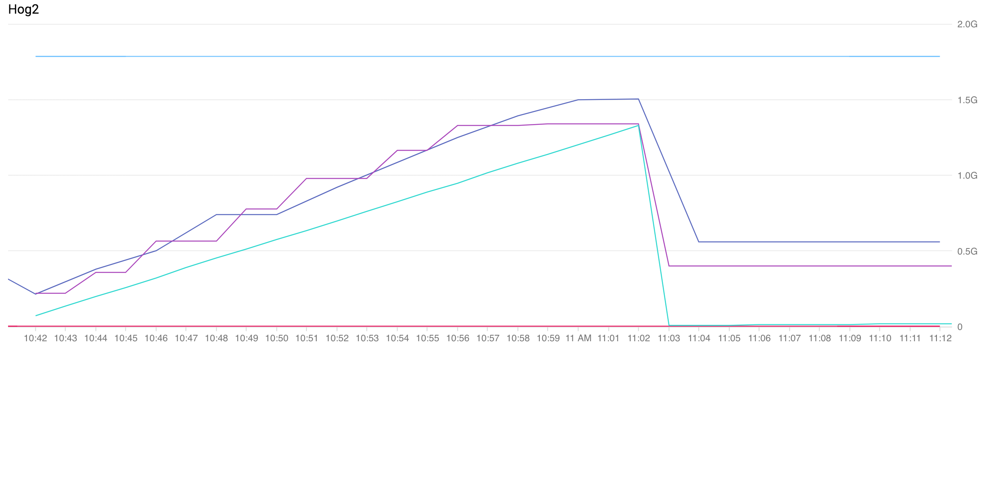
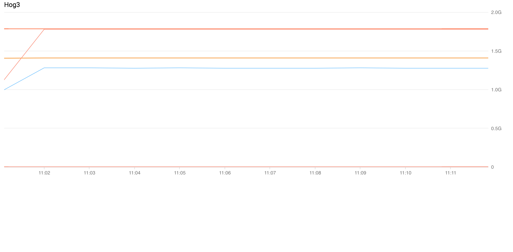

## Articles

http://trustmeiamadeveloper.com/2016/03/18/where-is-my-memory-java/

http://linuxaria.com/howto/linux-memory-management

## Test 1.0

This one runs until it eats all the memory. After releasing the memory Kubernetes kills is after a few seconds. 
However if I initiate a manual GC after the memory is released Kubernetes doesn't kill the Pod. My
guess is Kubernetes gives the Pod some time before it kills it but automatic GC doesn't kick in fast enough.

```yaml
apiVersion: v1
kind: Pod
metadata:
  name: memoryhog
spec:
  containers:
  - name: memoryhog
    image: adamsandor83/memoryhog:v1
    env:
      - name: PINKY_CONSUME_MB
        value: "300"
      - name: PINKY_RELEASE_AFTER_SEC
        value: "30"
      - name: PINKY_CONSUME_RATE
        value: "5"
    resources:
        limits:
            memory: 400Mi
```

## Test 2

This one worked fine. 

```yaml
apiVersion: v1
kind: Pod
metadata:
  name: memoryhog-high
spec:
  containers:
  - name: memoryhog
    image: adamsandor83/memoryhog:v1
    env:
      - name: PINKY_CONSUME_MB
        value: "700"
      - name: PINKY_RELEASE_AFTER_SEC
        value: "20"
      - name: PINKY_CONSUME_RATE
        value: "5"
      - name: JMX_HOSTNAME
        valueFrom:
          fieldRef:
            fieldPath: status.podIP
    resources:
        limits:
            memory: 1000Mi
        requests:
            memory: 1000Mi
    ports:
      - containerPort: 9999
        name: jmx
```

## Test 3 - high memory

This results in the pod getting OOM killed by K8s. Also looks like the memory request has an effect on
the inital memory usage of the Pod.

The calculated max heap size will be:
```
Max. Heap Size (Estimated): 1.48G
```

```yaml
apiVersion: v1
kind: Pod
metadata:
  name: memoryhog
spec:
  containers:
  - name: memoryhog
    image: adamsandor83/memoryhog:v2
    env:
      - name: FEED_BACON
        value: "true"
      - name: BACON_CONSUME_UNTIL_MINUTES
        value: "60"
      - name: BACON_CONSUME_RATE_MB_PER_SECOND
        value: "100"
      - name: FEED_PINKY
        value: "true"
      - name: PINKY_CONSUME_MB
        value: "1400"
      - name: PINKY_RELEASE_AFTER_SEC
        value: "600"
      - name: PINKY_CONSUME_RATE
        value: "1"
      - name: JMX_HOSTNAME
        valueFrom:
          fieldRef:
            fieldPath: status.podIP
    resources:
        limits:
            memory: 1700Mi
        requests:
            memory: 500Mi
    ports:
      - containerPort: 9999
        name: jmx
```

## Test 3.1 - same without feeding Bacon

If Bacon is not getting fed (releasable memory is not used) this memory limit is enough.



```yaml
apiVersion: v1
kind: Pod
metadata:
  name: memoryhog
spec:
  containers:
  - name: memoryhog
    image: adamsandor83/memoryhog:v2
    env:
      - name: FEED_BACON
        value: "false"
      - name: BACON_CONSUME_UNTIL_MINUTES
        value: "60"
      - name: BACON_CONSUME_RATE_MB_PER_SECOND
        value: "100"
      - name: FEED_PINKY
        value: "true"
      - name: PINKY_CONSUME_MB
        value: "1400"
      - name: PINKY_RELEASE_AFTER_SEC
        value: "600"
      - name: PINKY_CONSUME_RATE
        value: "1"
      - name: JMX_HOSTNAME
        valueFrom:
          fieldRef:
            fieldPath: status.podIP
    resources:
        limits:
            memory: 1700Mi
        requests:
            memory: 500Mi
    ports:
      - containerPort: 9999
        name: jmx
```

## Test 4

When only Bacon is fed we can see nice rising graph. Kubernetes and JVMHeap usage go hand in hand and
it looks like the JVM even releases the memory to the system after garbage collection.



```yaml
apiVersion: v1
kind: Pod
metadata:
  name: memoryhog
spec:
  containers:
  - name: memoryhog
    image: adamsandor83/memoryhog:v2
    env:
      - name: FEED_BACON
        value: "true"
      - name: BACON_CONSUME_UNTIL_MINUTES
        value: "60"
      - name: BACON_CONSUME_RATE_MB_PER_SECOND
        value: "300"
      - name: FEED_PINKY
        value: "false"
      - name: PINKY_CONSUME_MB
        value: "1400"
      - name: PINKY_RELEASE_AFTER_SEC
        value: "600"
      - name: PINKY_CONSUME_RATE
        value: "1"
      - name: JMX_HOSTNAME
        valueFrom:
          fieldRef:
            fieldPath: status.podIP
    resources:
        limits:
            memory: 1700Mi
        requests:
            memory: 500Mi
    ports:
      - containerPort: 9999
        name: jmx

```